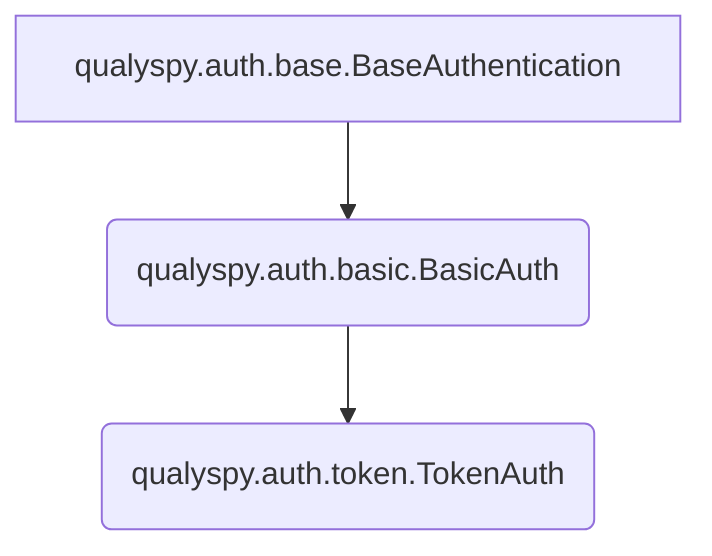

# qualyspy - A Python Package for Interacting With Qualys APIs
```
··············································
:   ____             _                       :
:  /___ \_   _  __ _| |_   _ ___ _ __  _   _ :
: //  / | | | |/ _` | | | | / __| '_ \| | | |:
:/ \_/ /| |_| | (_| | | |_| \__ | |_) | |_| |:
:\___,_\ \__,_|\__,_|_|\__, |___| .__/ \__, |:
:                      |___/    |_|    |___/ :
··············································
 ```

This package attempts to make it much easier to interact with Qualys's various API endpoints, across as many modules as I can get to coding. 

[](https://github.com/psf/black)  

## Uber Class Example
```py
from qualyspy import TokenAuth, GAVUber

auth = TokenAuth(<username>, <password>, platform='qg1')
uber = GAVUber(auth)

assets = uber.get(
    "query_assets", 
    filter='operatingSystem:"Linux"', 
    lastModifiedDate="2024-06-21"
    )
>>>[AssetID(012345678), ...]
```
## Non-Uber Class Example
```py
from qualyspy.auth import BasicAuth
from qualyspy.vmdr import get_scan_list

auth = BasicAuth(<username>,'password', platform='qg1')

scans = get_scan_list(auth)
>>>[VMScan(REF='scan/123456789', TITLE='My Scan')]
```

## Current Supported Modules 
|Module| Status |
|--|--|
| GAV (Global AssetView) |✅|
| VMDR | In Progress (```query_kb```, ```get_host_list```, ```get_hld```, ```get_ag_list```, ```add/edit/remove_ag```, ```get_ip_list```, ```add/update_ips``` implemented) |
| PM (Patch Management) | In Planning |
| WAS | Not Started |
| TC (TotalCloud) | Not Started |
|Connectors | Not Started |
|Cloud Agent | Not Started |
|CS (Container Security) | Not Started
|ADMIN (Administration) | Not Started
|Tagging| Not Started

# Getting Started

To install using poetry, run the following commands:
```bash
git clone https://0x41424142/qualyspy.git
cd qualyspy
poetry shell #if you want to use a venv
poetry install
```
You can also install using pip, preferably in a virtual environment:
```bash
git clone https://0x41424142/qualyspy.git
pip install qualyspy
```

# Auth Classes

```qualyspy``` supports both HTTP Basic Authentication (used mainly for VMDR-based calls) as well as JWT Authentication. 

>**Pro Tip**: Both ```BasicAuth``` and ```TokenAuth``` can be used as **context managers**!

>**Heads Up!**: By default, auth classes assume your Qualys subscription is on the ```qg3``` platform. If this is not the case, simply pass ```platform='qg<n>'``` where \<n> is 1-4 when creating the object.

When calling an API endpoint, just pass your ```TokenAuth``` or ```BasicAuth``` object and the tool will handle the rest (or yell at you if you pass the wrong type, shown below):
```py
#Example of using the wrong auth type
from qualyspy.auth import BasicAuth
from qualyspy.gav import count_assets #GAV expects JWT auth

with BasicAuth(<username>,<password>, platform='qg1') as auth:
    count = count_assets(auth, filter='operatingSystem.category1:`Linux`')
    ...

>>>qualyspy.exceptions.Exceptions.AuthTypeMismatchError: Auth type mismatch. Expected token but got basic.
 ```
 <br>
 
Both ```BasicAuth``` and ```TokenAuth``` also have ```from_dict``` class methods, which allows for the creation of these objects from dictionaries:
```py
from qualyspy.auth import BasicAuth
auth = BasicAuth.from_dict({'username':<username>, 'password':<password>})
```
You can also create an object using a JSON string using ```from_json_string```:
```py
from qualyspy.auth import BasicAuth
auth = BasicAuth.from_json_string('{"username":<username>, "password":<password>}')
```

You can also export using ```to_json_string```. If ```pretty=True```, the string will be pretty formatted:
```py
from qualyspy.auth import BasicAuth
auth = BasicAuth.from_dict({'username':<username>, 'password':<password>})

#No formatting:
auth.to_json_string()
>>>'{"username": <username>, "password": <password>, "token": null, "auth_type": "basic", "platform": <platform>}'
#With formatting:
auth.to_json_string(pretty=True)
>>>{
    "username": <username>,
    "password": <password>,
    "token": null,
    "auth_type": "basic",
    "platform": <platform>
}
```

## Auth Class Hierarchy

---

# Global AssetView APIs
Global AssetView APIs return data on hosts within your Qualys subscription. 
>**Pro Tip**: To see all available GAV QQL filters, look [here!](https://docs.qualys.com/en/gav/2.18.0.0/search/how_to_search.htm)

After running:
```py
from qualyspy.gav import *
```
You can any of the 4 GAV endpoints:

## GAV Endpoints
|API Call| Description |
|--|--|
| ```count_assets``` | Count assets based on the ```filter``` kwarg, which is written in Qualys QQL.|
```get_asset```|Get a specific host based on the ```assetId``` kwarg.|
```get_all_assets```| Pull the entire host inventory (or a few pages of it with ```page_count```), in file sizes of ```pageSize```. Does **NOT** support ```filter```.|
|```query_assets```| Scaled down version of```get_all_assets``` - pulls entire host inventory that matches the given ```filter``` kwarg.

Or use the uber class:
```py
from qualyspy import TokenAuth, GAVUber

#Hey look! context managers!
with TokenAuth(<username>, <password>, platform='qg1') as auth:
    with GAVUber(auth) as uber:
        full_inventory_count = uber.get("count_assets")
        ...
```

## The GAV Host Dataclass
>**Heads Up!**: The ```Host``` class does not apply to ```count_assets()```

When results are received from a GAV API, each host record is stored in a ```Host``` object, with its data points as attributes. The ```Host``` class is decorated with ```@dataclass(frozen=True)``` to maintain consistency with the Qualys platform.	

Chances are, there will be a good chunk of attributes returned from Qualys that will be null. To deal with this, almost all attributes are defined as ```typing.Optional[]```, with the main exception being ```assetId```. It is also somewhat likely that I have mistyped certain attributes, as both the Qualys documentation and the data I am working with to build this package return a decent amount of null values. Should you come across something, submit a PR.

# VMDR APIs
VMDR APIs return data on vulnerabilities in your environment as well as from the Qualys KB. It also returns data on assets, IPs/subnets, asset groups, and more.

After running:
```py
from qualyspy.vmdr import *
```
You can use any of the VMDR endpoints currently supported:

## VMDR Endpoints
|API Call| Description |
|--|--|
| ```query_kb``` | Query the Qualys KnowledgeBase (KB) for vulnerabilities.|
| ```get_host_list``` | Query your VMDR host inventory based on kwargs. |
|```get_hld``` | Query your VMDR host inventory with QID detections under the ```VMDRHost.DETECTION_LIST``` attribute.

## Host List Detection
```vmdr.get_hld()``` is the main API for extracting vulnerabilities out of the Qualys platform. It is one of the slowest APIs to return data due to Qualys taking a while to gather all the necessary data, but is arguably the most important. Pagination is controlled via the ```page_count``` parameter. By default, this is set to ```"all"```, pulling all pages. You can specify an int to limit pagination, as well as ```truncation_limit``` to specify how many hosts should be returned per page.

This function implements threading to significantly speed up data pulls. The number of threads is controlled by the ```threads``` parameter, which defaults to 5. A ```Queue``` object is created, containing chunks of hostIDs (pulled via ```get_host_list``` with ```details=None```) that the threads pop from. The threads then call the ```hld_backend``` function with the hostIDs they popped from the queue. The user can control how many IDs are in a chunk via the ```chunk_size``` parameter, which defaults to 3000. You should create a combination of ```threads``` and ```chunk_size``` that keeps all threads busy, while respecting your Qualys concurrency limit. There is also the ```chunk_count``` parameter, which controls how many chunks a thread will pull out of the ```Queue``` before it exits.

Some important kwargs this API accepts:
|Kwarg| Possible Values |Description|
|--|--|--|
|```show_tags```| ```False/True```|Boolean on if API output should include Qualys host tags. Accessible under ```<VMDRHost>.TAGS```. Defaults to False.|
|```host_metadata```| ```'all','ec2','azure'```|Controls if cloud host details should be returned. It is **highly recommended** to use ```all``` if specified.|
|```show_cloud_tags```| ```False/True```|Boolean on if API output should include cloud provider tags. Accessible under ```<VMDRHost>.CLOUD_TAGS```. Defaults to False.|
|```filter_superseded_qids```|```False/True```|Boolean on if API output should only include non-superseded QIDs. Defaults to False.|
|```show_qds```|```False/True```|Boolean on if API output should include the Qualys Detection Score. Accessible under ```<VMDRHost>.QDS```. Defaults to False.|
|```show_qds_factors```|```False/True```|Boolean on if API output should include the Qualys Detection Score factors, such as EPSS score, CVSS score, malware hashes, and real-time threat indicators (RTIs). Accessible under ```<VMDRHost>.QDS_FACTORS```. Defaults to False.|
|```qids```|```None/QID_numbers```|Filter API output to a specific set of QIDs. Can be a comma-separated string: ```1357,2468,8901```, a range: ```12345-54321```, or a single QID: ```12345```.|
|```ids```|```None/hostIDs```|Filter API output to a specific set of host IDs. Can be a comma-separated string: ```1357,2468,8901```, a range: ```12345-54321```, or a single host ID: ```12345```.|

>**Heads Up!**: For a full breakdown of acceptable kwargs, see Qualys' documentation [here](https://cdn2.qualys.com/docs/qualys-api-vmpc-user-guide.pdf).
```py
from qualyspy import BasicAuth
from qualyspy.vmdr import get_hld

auth = BasicAuth(<username>, <password>, platform='qg1')

# Pull 2 pages containing 50 assets each that meet the following criteria:
# non-superseded QIDs, on-prem and EC2 assets, all tags included
hosts_with_detections = get_hld(
	auth, show_tags=True, show_cloud_tags=True, 
	filter_superseded_qids=True, host_metadata='ec2', 
	page_count=2, truncation_limit=50
)
>>>BaseList[VMDRHost(12345), ...]
```
## VMDR Host List
The ```get_host_list()``` API returns a ```BaseList``` of VMDRHost or VMDRID dataclasses. Pagination is controlled via the ```page_count``` kwarg. By default, this is set to ```"all"```, pulling all pages. You can specify an int to limit pagination.

Using the ```details``` kwarg, the shape of the output can be controlled:

|Details Value|Description|
|--|--|
|```None/"None"```| Return ```list[int]``` of host IDs (or asset IDs if ```show_asset_id=1```).|
|```"Basic"```| Return ```list[dict]``` containing basic host details, such as ID, DNS, IP, OS.|
|```"Basic/AGs"```| Return a ```list[dict]``` containing basic host details, plus asset group information.|
|```"All"```| Return a ```list[dict]``` containing all host details.|
|```"All/AGs"```| Return a ```list[dict]``` containing all host details plus asset group information.

```py
from qualyspy import BasicAuth
from qualyspy.vmdr import get_host_list

auth = BasicAuth(<username>, <password>, platform='qg1')

#Pull 4 pages of hosts, with "All/AGs" details & tags, 
# where VM scan results were processed after a specific date:
yesterdays_scanned_assets = get_host_list(
    auth, 
    details="All/AGs",
    show_tags=True,
    vm_processed_after="2024-06-21",
    page_count=4
) 
```

## IP Management

This collection of APIs allows for the management of IP addresses/ranges in VMDR, located under ```qualyspy.vmdr.ips```. The APIs are as follows:

|API Call| Description|
|--|--|
|```get_ip_list```| Get a list of IP addresses or ranges in VMDR.|
|```add_ips```| Add IP addresses or ranges to VMDR.|
|```update_ips```| Change details of IP addresses or ranges from VMDR.|
---
### Get IP List API

The ```get_ip_list()``` API returns a list of all IP addresses or ranges in VMDR, matching the given kwargs. Acceptable params are:
|Parameter| Possible Values |Description|Required|
|--|--|--|--|
|```auth```|```qualyspy.auth.BasicAuth```|The authentication object.|✅|
|```ips```|```str(<ip_address/range>)``` or ```BaseList[str, IPV4Address, IPV4Network, IPV6Address, IPV6Network]```|The IP address or range to search for.|❌|
|```network_id```|```str```|The network ID to search for.|❌ (usually not even enabled in a Qualys subscription)|
|```tracking_method```|```Literal['IP', 'DNS', 'NETBIOS']```| Return IPs/ranges based on the tracking method.|❌|
|```compliance_enabled```|```bool```|Return IPs/ranges based on if compliance tracking is enabled on it.|❌|
|```certview_enabled```|```bool```|Return IPs/ranges based on if CertView tracking is enabled on it.|❌|

```py
from qualyspy import BasicAuth
from qualyspy.vmdr.ips import get_ip_list

auth = BasicAuth(<username>, <password>, platform='qg1')

#Get all IP addresses/ranges in VMDR that have CertView tracking enabled:
certview_ips = get_ip_list(auth, certview_enabled=True)

#Get specific IP addresses/ranges:
specific_ips = get_ip_list(auth, ips='1.2.3.4,5.6.7.8,9.10.11.12/24')

#Slice the list of IP addresses/ranges to those that are external:
external_ips = [i for i in get_ip_list(auth) if not i.is_private]
```
---
### Add IPs API
The ```add_ips()``` API allows for the addition of IP addresses or ranges to VMDR. Acceptable params are:
|Parameter| Possible Values |Description|Required|
|--|--|--|--|
|```auth```|```qualyspy.auth.BasicAuth```|The authentication object.|✅|
|```ips```|```str(<ip_address/range>)``` or ```BaseList[str, IPV4Address, IPV4Network, IPV6Address, IPV6Network]```|The IP address or range to add.|✅|
|```tracking_method```|```Literal['IP', 'DNS', 'NETBIOS']```| The tracking method to use for the IP address/range.|❌|
|```enable_pc```|```bool```|Enable Policy Compliance tracking on the IP address/range.|See **Heads Up!** below.|
|```enable_vm```|```bool```|Enable Vulnerability Management tracking on the IP address/range.|See **Heads Up!** below.|
|```enable_sca```|```bool```|Enable Security Configuration Assessment tracking on the IP address/range.|See **Heads Up!** below.|
|```enable_certview```|```bool```|Enable CertView tracking on the IP address/range.|See **Heads Up!** below.|
|```tracking_method```|```Literal['IP', 'DNS', 'NETBIOS']```|The tracking method to use for the IP address/range. Defaults to IP.|❌|
|```owner```|```str```|The owner of the IP address/range.|❌|
|```ud1```|```str```|The user-defined field 1 (comment).|❌|
|```ud2```|```str```|The user-defined field 2 (comment).|❌|
|```ud3```|```str```|The user-defined field 3 (comment).|❌|
|```comment```|```str```|A comment to add to the IP address/range.|❌|
|```ag_title```|```str```|The title of the asset group to add the IP address/range to.|❌|

>**Heads Up!**: At least one of the following must be enabled: ```enable_pc```, ```enable_vm```, ```enable_sca```, or ```enable_certview```, or the API will return an error.

```py
from qualyspy import BasicAuth
from qualyspy.vmdr.ips import add_ips

auth = BasicAuth(<username>, <password>, platform='qg1')

#Add an IP address/range to VMDR with VM tracking enabled:
add_ips(auth, ips='1.2.3.4', enable_vm=True)
```
---
### Update IPs API
The ```update_ips()``` API allows for the modification of IP addresses or ranges in VMDR. Acceptable params are:
|Parameter| Possible Values |Description|Required|
|--|--|--|--|
|```auth```|```qualyspy.auth.BasicAuth```|The authentication object.|✅|
|```ips```|```str(<ip_address/range>)``` or ```BaseList[str, IPV4Address, IPV4Network, IPV6Address, IPV6Network]```|The IP address or range to update.|✅|
|```tracking_method```|```Literal['IP', 'DNS', 'NETBIOS']```| The tracking method to use for the IP address/range.|❌|
|```host_dns```|```str```|The DNS name of the IP address/range.|❌|
|```host_netbios```|```str```|The NetBIOS name of the IP address/range.|❌|
|```owner```|```str```|The owner of the IP address/range.|❌|
|```ud1```|```str```|The user-defined field 1 (comment).|❌|
|```ud2```|```str```|The user-defined field 2 (comment).|❌|
|```ud3```|```str```|The user-defined field 3 (comment).|❌|
|```comment```|```str```|A comment to add to the IP address/range.|❌|

```py
from qualyspy import BasicAuth
from qualyspy.vmdr.ips import update_ips

auth = BasicAuth(<username>, <password>, platform='qg1')

#Update an IP address/range in VMDR with a new DNS name:
update_ips(auth, ips='1.2.3.4', host_dns='new_dns_name')
```
---
## Asset Group Management
This collection of APIs allows for the management of asset groups (AGs) in VMDR, located under ```qualyspy.vmdr.assetgroups```. The APIs are as follows:

|API Call| Description|
|--|--|
|```get_ag_list```| Get a ```BaseList``` of ```AssetGroup``` objects.|
---

### Get Asset Group List API

The ```get_ag_list()``` API returns a list of all AGs in VMDR, matching the given kwargs. Acceptable params are:
|Parameter| Possible Values |Description|Required|
|--|--|--|--|
|```auth```|```qualyspy.auth.BasicAuth```|The authentication object.|✅|
|```page_count```|```Literal['all']``` (default), ```int >= 0```| How many pages to pull. Note that ```page_count``` does not apply if ```truncation_limit``` is set to 0, or not specified.|❌|
|```ids```|```str```: '12345', '12345,6789'| Filter to specific AG IDs.|❌|
|```id_min```|```int```| Only return AGs with an ID >= ```id_min```.| ❌|
```id_max```|```int```| Only return AGs with an ID <= ```id_max```.|❌|
|```truncation_limit```| ```int```| Specify how many AGs per page. If set to 0 or not specified, returns all AGs in one pull.| ❌|
|```network_ids```|```str```: '12345', '12345,6789'| Only return AGs with specific network IDs.|❌|
|```unit_id```|```str```: 01234| Only return AGs with a specific unit ID. Only one ID is accepted.|❌|
|```user_id```|```str```| Only return AGs with a specific user assigned. Only one ID is accepted.|❌|
|```title```|```str```: "My Asset Group"| Only return AGs with a specific title. Must be an exact string match.|❌|
|```show_attributes```|```str```: 'ALL', 'ID', 'TITLE', 'ID,TITLE', ```...``` (For full list, check [Qualys documentation](https://cdn2.qualys.com/docs/qualys-api-vmpc-user-guide.pdf), under "Asset Group List" Section.| Only return specific attributes of an AG record. If not specified, basic details are returned (ID, TITLE, ```...```)|❌|

```py
from qualyspy.auth import BasicAuth
from qualyspy.vmdr import get_ag_list

auth = BasicAuth(<username>, <password>, platform='qg1')

ag_list = get_ag_list(auth)
```

### Add Asset Group API
The ```add_ag()``` API allows for the addition of asset groups to VMDR. Acceptable params are:
|Parameter| Possible Values |Description|Required|
|--|--|--|--|
|```auth```|```qualyspy.auth.BasicAuth```|The authentication object.|✅|
|```title```|```str```|The title of the asset group.|✅|
|```comments```|```str```|Comments to add to the asset group.|❌|
|```division```|```str```|The division the asset group belongs to.|❌|
|```function```|```str```|The function of the asset group.|❌|
|```business_impact```|```Literal["critical", "high", "medium", "low", "none"]```|The business impact of the asset group.|❌|
|```ips```|```Union[str, BaseList[str, IPV4Address, IPV4Network, IPV6Address, IPV6Network]]```|The IP addresses or ranges to add to the asset group.|❌|
|```appliance_ids```|```Union[str, BaseList[int]]```|The appliance IDs to add to the asset group.|❌|
|```default_appliance_id```|```int```|The default appliance ID for the asset group.|❌|
|```domains```|```Union[str, BaseList[str]]```|The domains to add to the asset group.|❌|
|```dns_names```|```Union[str, BaseList[str]]```|The DNS names to add to the asset group.|❌|
|```netbios_names```|```Union[str, BaseList[str]]```|The NetBIOS names to add to the asset group.|❌|
|```cvss_enviro_cdp```|```Literal["high", "medium-high", "low-medium", "low", "none"]```|The CVSS environmental CDP of the asset group.|❌|
|```cvss_enviro_td```|```Literal["high", "medium", "low", "none"]```|The CVSS environmental TD of the asset group.|❌|
|```cvss_enviro_cr```|```Literal["high", "medium", "low"]```|The CVSS environmental CR of the asset group.|❌|
|```cvss_enviro_ir```|```Literal["high", "medium", "low"]```|The CVSS environmental IR of the asset group.|❌|
|```cvss_enviro_ar```|```Literal["high", "medium", "low"]```|The CVSS environmental AR of the asset group.|❌|

```py
from qualyspy.auth import BasicAuth
from qualyspy.vmdr import add_ag

auth = BasicAuth(<username>, <password>, platform='qg1')

#Add an asset group to VMDR with a specific title:
add_ag(auth, title='My New Asset Group')
>>>Asset Group Added Successfully.
```

### Edit Asset Group API
The ```edit_ag()``` API allows for the modification of asset groups in VMDR. Acceptable params are:

|Parameter| Possible Values |Description|Required|
|--|--|--|--|
|```auth```|```qualyspy.auth.BasicAuth```|The authentication object.|✅|
|```id```|```Union[AssetGroup, BaseList[AssetGroup, int, str], str]```|The ID of the asset group to edit.|✅|
|```set_comments```|```str```|The comments to set for the asset group.|❌|
|```set_division```|```str```|The division to set for the asset group.|❌|
|```set_function```|```str```|The function to set for the asset group.|❌|
|```set_location```|```str```|The location to set for the asset group.|❌|
|```set_business_impact```|```Literal["critical", "high", "medium", "low", "none"]```|The business impact to set for the asset group.|❌|
|```add_ips```|```Union[str, BaseList[str, IPV4Address, IPV4Network, IPV6Address, IPV6Network]]```|The IP addresses or ranges to add to the asset group.|❌|
|```remove_ips```|```Union[str, BaseList[str, IPV4Address, IPV4Network, IPV6Address, IPV6Network]]```|The IP addresses or ranges to remove from the asset group.|❌|
|```set_ips```|```Union[str, BaseList[str, IPV4Address, IPV4Network, IPV6Address, IPV6Network]]```|The IP addresses or ranges to set for the asset group.|❌|
|```add_appliance_ids```|```Union[str, BaseList[int]]```|The appliance IDs to add to the asset group.|❌|
|```remove_appliance_ids```|```Union[str, BaseList[int]]```|The appliance IDs to remove from the asset group.|❌|
|```set_appliance_ids```|```Union[str, BaseList[int]]```|The appliance IDs to set for the asset group.|❌|
|```set_default_appliance_id```|```int```|The default appliance ID to set for the asset group.|❌|
|```add_domains```|```Union[str, BaseList[str]]```|The domains to add to the asset group.|❌|
|```remove_domains```|```Union[str, BaseList[str]]```|The domains to remove from the asset group.|❌|
|```set_domains```|```Union[str, BaseList[str]]```|The domains to set for the asset group.|❌|
|```add_dns_names```|```Union[str, BaseList[str]]```|The DNS names to add to the asset group.|❌|
|```remove_dns_names```|```Union[str, BaseList[str]]```|The DNS names to remove from the asset group.|❌|
|```set_dns_names```|```Union[str, BaseList[str]]```|The DNS names to set for the asset group.|❌|
|```add_netbios_names```|```Union[str, BaseList[str]]```|The NetBIOS names to add to the asset group.|❌|
|```remove_netbios_names```|```Union[str, BaseList[str]]```|The NetBIOS names to remove from the asset group.|❌|
|```set_netbios_names```|```Union[str, BaseList[str]]```|The NetBIOS names to set for the asset group.|❌|
|```set_title```|```str```|The title to set for the asset group.|❌|
|```set_cvss_enviro_cdp```|```Literal["high", "medium-high", "low-medium", "low", "none"]```|The CVSS environmental CDP to set for the asset group.|❌|
|```set_cvss_enviro_td```|```Literal["high", "medium", "low", "none"]```|The CVSS environmental TD to set for the asset group.|❌|
|```set_cvss_enviro_cr```|```Literal["high", "medium", "low"]```|The CVSS environmental CR to set for the asset group.|❌|
|```set_cvss_enviro_ir```|```Literal["high", "medium", "low"]```|The CVSS environmental IR to set for the asset group.|❌|
|```set_cvss_enviro_ar```|```Literal["high", "medium", "low"]```|The CVSS environmental AR to set for the asset group.|❌|

```py
from qualyspy.auth import BasicAuth
from qualyspy.vmdr import edit_ag

auth = BasicAuth(<username>, <password>, platform='qg1')

#Edit an asset group in VMDR with a new title:
edit_ag(auth, id=12345, set_title='My New Asset Group Title')
>>>Asset Group Updated Successfully.
```
---

### Delete Asset Group API
The ```delete_ag()``` API allows for the deletion of asset groups in VMDR. Acceptable params are:

|Parameter| Possible Values |Description|Required|
|--|--|--|--|
|```auth```|```qualyspy.auth.BasicAuth```|The authentication object.|✅|
|```id```|```Union[AssetGroup, BaseList[AssetGroup, int, str], str]```|The ID of the asset group to delete.|✅|

```py
from qualyspy.auth import BasicAuth
from qualyspy.vmdr import delete_ag

auth = BasicAuth(<username>, <password>, platform='qg1')

#Delete an asset group in VMDR:
delete_ag(auth, id=12345)
>>>Asset Group Deleted Successfully.
```
---
## VM Scan Management
This collection of APIs allows for the management of VM scans in VMDR, located under ```qualyspy.vmdr.vmscans```. The APIs are as follows:

|API Call| Description|
|--|--|
|```get_scan_list```| Get a ```BaseList``` of ```VMScan``` objects.|

### VMScan Dataclass
The ```VMScan``` dataclass is used to store the various fields that the VMDR VM Scan APIs return. Attributes are as follows:

|Attribute|Type|Description|
|--|--|--|
|```REF```|```str```|Reference string for the scan. Formatted as module/ID.|
|```TYPE```|```Literal["On-Demand","API","Scheduled]```|How the scan is ran.|
|```TITLE```|```str```|The scan name.|
|```USER_LOGIN```|```str```|The Qualys account that created/owns the scan.|
|```LAUNCH_DATETIME```|```datetime.datetime```|The date and time the scan was launched.|
|```DURATION```|```datetime.timedelta```|The duration of the scan.|
|```PROCESSING_PRIORTIY```|```str```|The processing priority of the scan. Includes an int followed by a description of the priority level, such as: ```0 - No Priority```.|
|```PROCESSED```|```bool```|If the scan results have been processed.|
|```STATUS```|```dict```|Status metadata points of the scan. Includes ```state```, which is saved into the ```STATE``` attribute.|
|```STATE```|```str```|The state of the scan.|
|```TARGET```|```Union[str, BaseList[str], BaseList[ipaddress.IPv4Address, ipaddress.IPv4Network]]```|The target IPs for the scan.|
|```OPTION_PROFILE```|```dict```|The option profile metadata for the scan.|
|```ASSET_GROUP_TITLE_LIST```|```BaseList[str]```|The asset group titles covered by the scan.|
---
### Get Scan List API

The ```get_scan_list()``` API returns a list of all VM scans in VMDR, matching the given kwargs. Acceptable params are:

|Parameter| Possible Values |Description|Required|
|--|--|--|--|
|```auth```|```qualyspy.auth.BasicAuth```|The authentication object.|✅|
|```scan_ref```|```str```|The reference string of the scan to search for. Formatted like: ```scan/123455677```|❌|
|```state```|```Literal["Running", "Paused", "Cancelled", "Finished", "Error", "Queued", "Loading"]```|Filter by the state of the scan.|❌|
|```processed```|```bool```|Filter by if the scan results have been processed.|❌|
|```type```|```Literal["On-Demand","API","Scheduled]```|Filter by how the scan is set up.|❌|
|```user_login```|```str```|Filter by the Qualys account that created/owns the scan.|❌|
|```launched_after_datetime```|```str```|Filter by scans launched after a specific datetime. Formatted as: ```2007-07-01``` or ```2007-01-25T23:12:00Z```|❌|
|```launched_before_datetime```|```str```|Filter by scans launched before a specific datetime. Formatted as: ```2007-07-01``` or ```2007-01-25T23:12:00Z```|❌|
|```scan_type```|```Literal["certview", "ec2certview"]```|Only return certview scans, or EC2 certview scans.|❌|
|```client_id```|```Union[str,int]```|Filter by the client ID of the scan. This must be enabled in the Qualys subscription.|❌|
|```client_name```|```str```|Filter by the client name of the scan. This must be enabled in the Qualys subscription.|❌|
|```show_ags```|```bool```|Include asset group titles in the scan list.|❌|
|```show_op```|```bool```|Include option profile metadata in the scan list.|❌|
|```show_status```|```bool```|Include status metadata in the scan list. Defaults to ```True```.|❌|
|```show_last```|```bool```|Only show the last run of each scan. Defaults to ```False```.|❌|
|```ignore_target```|```bool```|Ignore the target IPs of the scan. Defaults to ```False```.|❌|

```py
from qualyspy import BasicAuth
from qualyspy.vmdr import get_scan_list

auth = BasicAuth(<username>, <password>, platform='qg1')

#Get all VM scans in VMDR, with all details, that have a type of Scheduled:
scheduled_scans = get_scan_list(auth, type='Scheduled', show_ags=True, show_op=True)
>>>BaseList[VMScan(REF='scan/123456789', TYPE='Scheduled', TITLE='My Scheduled Scan', ...), ...]
```
---
## Querying the KB
The Qualys KnowledgeBase (KB) is a collection of vulnerabilities that Qualys has identified. You can query the KB using the ```query_kb()``` function:
>**Heads Up!**: When calling ```query_kb()```, the function returns a regular list of ```KBEntry``` objects.
```py
from qualyspy import BasicAuth, vmdr

with BasicAuth(<username>, <password>, platform='qg1') as auth:
    #Full KB pull:
    kb_query = vmdr.query_kb(auth)

    #or use kwargs to filter, 
    # for example QIDs published for a specific week:
    kb_query = vmdr.query_kb(auth, published_after='2024-06-21', published_before='2024-06-28')

    #Want to search the list of 
    # KBEntries based on some criteria?
    in_scope_qids = [entry for entry in kb_query if entry.QID in range(1000, 2000)]
    len(in_scope_qids)
>>>400
```

## Special Dataclasses for VMDR

There are quite a few special dataclasses that are used in the VMDR module, as well as a ```BaseList``` class that is used to store these dataclasses and add some easier string functionality.

For example, for KB entries, there is the ```KBEntry``` class which holds the various fields that the Qualys KB API returns. Inside a ```KBEntry``` object there are custom classes for things like ```ThreatIntel``` and ```Software```. Other examples include the ```VMDRHost``` class, which holds the various fields that the VMDR Host List API returns, and the ```Detection``` class, which holds the various fields that the VMDR Host List Detection API returns under a ```VMDRHost```.
```py
... #Prior KB pull

#Get the ThreatIntel attribute of the a KBEntry object, which is a custom dataclass:
kb_entry.THREAT_INTELLIGENCE
>>>BaseList([ThreatIntel(ID=4, TEXT='High_Lateral_Movement')])

#Or perhaps you want all the CVEs in a CVEList as a comma-separated string:
str(kb_entry.CVEList)
>>>'CVE-2024-1234, CVE-2024-5678, ...'
```

### KB Dataclasses
|Class| Attributes |
|--|--|
| ```VendorReference``` | ID, URL|
| ```ThreatIntel```| ID, TEXT|
| ```Software``` | PRODUCT, VENDOR |
|```CVEID```| ID, URL |
|```Compliance``` | _TYPE, SECTION, DESCRIPTION |
| ```Bugtraq``` | ID, URL |
----- 

# The CALL_SCHEMA Dictionary
>**TL;DR**: The ```CALL_SCHEMA``` is ***VERY*** important! 

CALL_SCHEMA is a backend ```frozendict``` dictionary that the package automatically uses to correctly set up the underlying ```qualyspy.base.call_api()``` function. ```call_api``` in turn then sets up the appropriate ```requests.Request()``` call using an endpoint's schema.

The schema stores information such as what HTTP methods the endpoint accepts, the authentication type the endpoint expects, its path, acceptable kwargs when calling an API (and whether a kwarg should be sent as a URL parameter, in a POST form, or using the requests' library's ```json=``` feature), what Qualys URL structure to use (gateway vs. qualysapi), and more.

The schema also allows all API calls to raise an exception if the user passes in a kwarg that is not valid for an endpoint.

There are also some values that do not influence program behavior, but are "good-to-knows" for users. See below.

## Querying the CALL_SCHEMA
If you want to take a look at what an endpoint (or what an entire module's collection of endpoints!) expects, you can do so programmatically:
>**Pro Tip!**: use ```schema_query(...pretty=True)``` to return a beautified string of the query results.

```py
from qualyspy import schema_query

#Get one specific endpoint's schema:
print(schema_query(module='gav', endpoint='query_assets'))
>>>{'endpoint': '/am/v1/assets/host/filter/list', 'method': ['POST'], 'valid_params': ['filter', 'excludeFields', 'includeFields', 'lastModifiedDate', 'lastSeenAssetId', 'pageSize'], 'valid_POST_data': [], 'use_requests_json_data': False, 'return_type': 'json', 'pagination': True, 'auth_type': 'token'}

#Get an entire module's worth of endpoint schemas, 
# which includes the module-level url_type:
print(schema_query(module='gav', pretty=True))
>>>{
    "url_type": "gateway", #Used by call_api() to determine which URL format to use.
    "count_assets": {
        "endpoint": "/am/v1/assets/host/count",
        "method": [
            "POST"
        ],
        "valid_params": [
            "filter",
            "lastSeenAssetId",
            "lastModifiedDate"
        ],
        "valid_POST_data": [],
        "use_requests_json_data": false,
        "return_type": "json",
        "pagination": false,
        "auth_type": "token"
    },
    "get_all_assets": {
	    ...
	}
}
```
# TODO:

- Continue adding VMDR APIs.

- Start work on PM module.

- Write testing files.

- Break up README.md: Move module-specific sections to their respective folders, cleaning up the main README.md.
