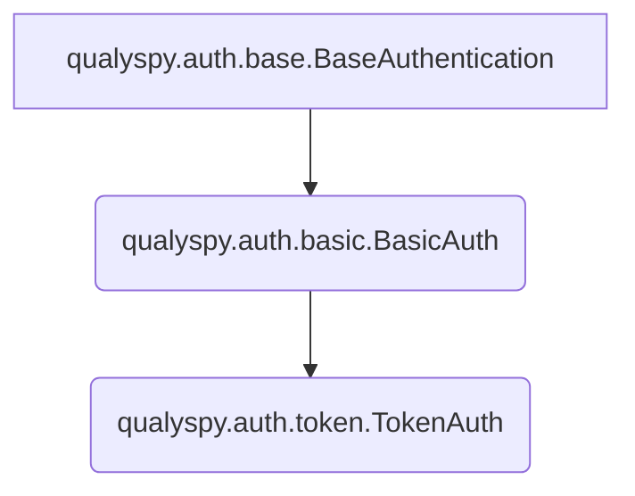

# qualyspy - A Python Package for Interacting With Qualys APIs
```
··············································
:   ____             _                       :
:  /___ \_   _  __ _| |_   _ ___ _ __  _   _ :
: //  / | | | |/ _` | | | | / __| '_ \| | | |:
:/ \_/ /| |_| | (_| | | |_| \__ | |_) | |_| |:
:\___,_\ \__,_|\__,_|_|\__, |___| .__/ \__, |:
:                      |___/    |_|    |___/ :
··············································
 ```

This package attempts to make it much easier to interact with Qualys's various API endpoints, across most modules.

[](https://github.com/psf/black) 

## Uber Class Example
```py
from qualyspy import TokenAuth, GAVUber

auth = TokenAuth(<username>, <password>, platform='qg1')
uber = GAVUber(auth)

assets = uber.get(
    "query_assets", 
    filter='operatingSystem:"Linux"', 
    lastModifiedDate="2024-06-21"
    )
>>>[AssetID(012345678), ...]
```
## Non-Uber Class Example
```py
from qualyspy.auth import TokenAuth
from qualyspy.gav import query_assets

auth = TokenAuth(<username>,'password', platform='qg1')

linux_servers_with_1cpu = query_assets(
	auth, 
	filter='operatingSystem.category1:`Linux` and operatingSystem.category2:`Server` and processors.numberOfCpu:1', 
	lastModifiedDate='2024-06-21'
) 
>>> linux_servers_with_1core
[AssetID(<0123>), AssetID(<4567>), ...]
```
## Current Supported Modules 
|Module| Status |
|--|--|
| GAV (Global AssetView) |✅|
| VMDR | In Progress (```query_kb```, ```get_host_list``` implemented) |
| PM (Patch Management) | In Progress |
| WAS | Not Started |
| TC (TotalCloud) | Not Started |
|Connectors | Not Started |
|Cloud Agent | Not Started |
|CS (Container Security) | Not Started
|ADMIN (Administration) | Not Started
|Tagging| Not Started

# Getting Started
To install using poetry, run the following commands:
```bash
git clone https://0x41424142/qualyspy.git
cd qualyspy
poetry shell #if you want to use a venv
poetry install
```
You can also install using pip, preferably in a virtual environment:
```bash
git clone https://0x41424142/qualyspy.git
pip install qualyspy
```
# Auth Classes
```qualyspy``` supports both HTTP Basic Authentication (used mainly for VMDR-based calls) as well as JWT Authentication. 

>**Pro Tip**: Both ```BasicAuth``` and ```TokenAuth``` can be used as **context managers**!

>**Heads Up!**: By default, auth classes assume your Qualys subscription is on the ```qg3``` platform. If this is not the case, simply pass ```platform='qg<n>'``` where \<n> is 1-4 when creating the object.

When calling an API endpoint, just pass your ```TokenAuth``` or ```BasicAuth``` object and the tool will handle the rest (or yell at you if you pass the wrong type, shown below):
```py
#Example of using the wrong auth type
from qualyspy.auth import BasicAuth
from qualyspy.gav import count_assets #GAV expects JWT auth

with BasicAuth(<username>,<password>, platform='qg1') as auth:
    count = count_assets(auth, filter='operatingSystem.category1:`Linux`')
    ...

>>>qualyspy.exceptions.Exceptions.AuthTypeMismatchError: Auth type mismatch. Expected token but got basic.
 ```
 <br>
 
Both ```BasicAuth``` and ```TokenAuth``` also have ```from_dict``` class methods, which allows for the creation of these objects from dictionaries:
```py
from qualyspy.auth import BasicAuth
auth = BasicAuth.from_dict({'username':<username>, 'password':<password>})
```
You can also create an object using a JSON string using ```from_json_string```:
```py
from qualyspy.auth import BasicAuth
auth = BasicAuth.from_json_string('{"username":<username>, "password":<password>}')
```

You can also export using ```to_json_string```. If ```pretty=True```, the string will be pretty formatted:
```py
from qualyspy.auth import BasicAuth
auth = BasicAuth.from_dict({'username':<username>, 'password':<password>})

#No formatting:
auth.to_json_string()
>>>'{"username": <username>, "password": <password>, "token": null, "auth_type": "basic", "platform": <platform>}'
#With formatting:
auth.to_json_string(pretty=True)
>>>{
    "username": <username>,
    "password": <password>,
    "token": null,
    "auth_type": "basic",
    "platform": <platform>
}
```

## Auth Class Hierarchy

# Global AssetView APIs
Global AssetView APIs return data on hosts within your Qualys subscription. 
>**Pro Tip**: To see all available GAV QQL filters, look [here!](https://docs.qualys.com/en/gav/2.18.0.0/search/how_to_search.htm)

After running:
```py
from qualyspy.gav import *
```
You can any of the 4 GAV endpoints:
|API Call| Description |
|--|--|
| ```count_assets``` | Count assets based on the ```filter``` kwarg, which is written in Qualys QQL.|
```get_asset```|Get a specific host based on the ```assetId``` kwarg.|
```get_all_assets```| Pull the entire host inventory (or a few pages of it with ```page_count```), in file sizes of ```pageSize```. Does **NOT** support ```filter```.|
|```query_assets```| Scaled down version of```get_all_assets``` - pulls entire host inventory that matches the given ```filter``` kwarg.

Or use the uber class:
```py
from qualyspy import TokenAuth, GAVUber

#Hey look! context managers!
with TokenAuth(<username>, <password>, platform='qg1') as auth:
    with GAVUber(auth) as uber:
        full_inventory_count = uber.get("count_assets")
        ...
```

## The GAV Host Dataclass
>**Heads Up!**: The ```Host``` class does not apply to ```count_assets()```

When results are received from a GAV API, each host record is stored in a ```Host``` object, with its data points as attributes. The ```Host``` class is decorated with ```@dataclass(frozen=True)``` to maintain consistency with the Qualys platform.	

Chances are, there will be a good chunk of attributes returned from Qualys that will be null. To deal with this, almost all attributes are defined as ```typing.Optional[]```, with the main exception being ```assetId```. It is also somewhat likely that I have mistyped certain attributes, as both the Qualys documentation and the data I am working with to build this package return a decent amount of null values. Should you come across something, submit a PR.

# VMDR APIs
VMDR APIs return data on vulnerabilities in your environment as well as from the Qualys KB.

After running:
```py
from qualyspy.vmdr import *
```
You can use any of the VMDR endpoints currently supported:
|API Call| Description |
|--|--|
| ```query_kb``` | Query the Qualys KnowledgeBase (KB) for vulnerabilities.|
| ```get_host_list``` | Query your VMDR host inventory based on kwargs. |
|```get_hld``` | Query your VMDR host inventory with QID detections under the ```VMDRHost.DETECTION_LIST``` attribute.

## Host List Detection
```vmdr.get_hld()``` is the main API for extracting vulnerabilities out of the Qualys platform. It is one of the slowest APIs to return data due to Qualys taking a while to gather all the necessary data, but is arguably the most important. Pagination is controlled via the ```page_count``` kwarg. By default, this is set to ```"all"```, pulling all pages. You can specify an int to limit pagination, as well as ```truncation_limit``` to specify how many hosts should be returned per page.
>**Heads Up!:** Work is being done to speed up this API call as much as possible. Using Python's ```threading``` library, we can call the host list API with ```details=None``` to get a list of ```VMDRID```s, chunk them, and put them in a thread-safe ```queue```. Stay tuned!

Some important kwargs this API accepts:
|Kwarg| Possible Values |Description|
|--|--|--|
|```show_tags```| ```False/True```|Boolean on if API output should include Qualys host tags. Accessible under ```<VMDRHost>.TAGS```. Defaults to False.|
|```host_metadata```| ```'all','ec2','azure'```|Controls if cloud host details should be returned. It is **highly recommended** to use ```all``` if specified.|
|```show_cloud_tags```| ```False/True```|Boolean on if API output should include cloud provider tags. Accessible under ```<VMDRHost>.CLOUD_TAGS```. Defaults to False.|
|```filter_superseded_qids```|```False/True```|Boolean on if API output should only include non-superseded QIDs. Defaults to False.|
|```show_qds```|```False/True```|Boolean on if API output should include the Qualys Detection Score. Accessible under ```<VMDRHost>.QDS```. Defaults to False.|
|```show_qds_factors```|```False/True```|Boolean on if API output should include the Qualys Detection Score factors, such as EPSS score, CVSS score, malware hashes, and real-time threat indicators (RTIs). Accessible under ```<VMDRHost>.QDS_FACTORS```. Defaults to False.|
|```qids```|```None/QID_numbers```|Filter API output to a specific set of QIDs. Can be a comma-separated string: ```1357,2468,8901```, a range: ```12345-54321```, or a single QID: ```12345```.|
|```ids```|```None/hostIDs```|Filter API output to a specific set of host IDs. Can be a comma-separated string: ```1357,2468,8901```, a range: ```12345-54321```, or a single host ID: ```12345```.|

>**Heads Up!**: For a full breakdown of acceptable kwargs, see Qualys' documentation [here](https://cdn2.qualys.com/docs/qualys-api-vmpc-user-guide.pdf).
```py
from qualyspy import BasicAuth
from qualyspy.vmdr import get_hld

auth = BasicAuth(<username>, <password>, platform='qg1')

# Pull 2 pages containing 50 assets each that meet the following criteria:
# non-superseded QIDs, on-prem and EC2 assets, all tags included
hosts_with_detections = get_hld(
	auth, show_tags=True, show_cloud_tags=True, 
	filter_superseded_qids=True, cloud_metadata='ec2', 
	page_count=2, truncation_limit=50
)
>>>BaseList[VMDRHost(12345), ...]
```
## VMDR Host List
The ```get_host_list()``` API returns (at the moment) a list of dictionary/int responses for assets in VMDR (in a later commit, it will return a list of VMDRHost or VMDRID dataclasses). Pagination is controlled via the ```page_count``` kwarg. By default, this is set to ```"all"```, pulling all pages. You can specify an int to limit pagination.

Using the ```details``` kwarg, the shape of the output can be controlled:

|Details Value|Description|
|--|--|
|```None/"None"```| Return ```list[int]``` of host IDs (or asset IDs if ```show_asset_id=1```).|
|```"Basic"```| Return ```list[dict]``` containing basic host details, such as ID, DNS, IP, OS.|
|```"Basic/AGs"```| Return a ```list[dict]``` containing basic host details, plus asset group information.|
|```"All"```| Return a ```list[dict]``` containing all host details.|
|```"All/AGs"```| Return a ```list[dict]``` containing all host details plus asset group information.

```py
from qualyspy import BasicAuth
from qualyspy.vmdr import get_host_list

auth = BasicAuth(<username>, <password>, platform='qg1')

#Pull 4 pages of hosts, with "All/AGs" details & tags, 
# where VM scan results were processed after a specific date:
yesterdays_scanned_assets = get_host_list(
    auth, 
    details="All/AGs",
    show_tags=True,
    vm_processed_after="2024-06-21",
    page_count=4
) 
```

## Querying the KB
The Qualys KnowledgeBase (KB) is a collection of vulnerabilities that Qualys has identified. You can query the KB using the ```query_kb()``` function:
>**Heads Up!**: When calling ```query_kb()```, the function returns a regular list of ```KBEntry``` objects.
```py
from qualyspy import BasicAuth, vmdr

with BasicAuth(<username>, <password>, platform='qg1') as auth:
    #Full KB pull:
    kb_query = vmdr.query_kb(auth)

    #or use kwargs to filter, 
    # for example QIDs published for a specific week:
    kb_query = vmdr.query_kb(auth, published_after='2024-06-21', published_before='2024-06-28')

    #Want to search the list of 
    # KBEntries based on some criteria?
    in_scope_qids = [entry for entry in kb_query if entry.QID in range(1000, 2000)]
    len(in_scope_qids)
>>>400
```

## Special Dataclasses for VMDR

There are quite a few special dataclasses that are used in the VMDR module, as well as a ```BaseList``` class that is used to store these dataclasses and add some easier string functionality.

For example, for KB entries, there is the ```KBEntry``` class which holds the various fields that the Qualys KB API returns. Inside a ```KBEntry``` object there are custom classes for things like ```ThreatIntel``` and ```Software```.
```py
... #Prior KB pull

#Get the ThreatIntel attribute of the a KBEntry object, which is a custom dataclass:
kb_entry.THREAT_INTELLIGENCE
>>>BaseList([ThreatIntel(ID=4, TEXT='High_Lateral_Movement')])

#Or perhaps you want all the CVEs in a CVEList as a comma-separated string:
str(kb_entry.CVEList)
>>>'CVE-2024-1234, CVE-2024-5678, ...'
```

### KB Dataclasses
|Class| Attributes |
|--|--|
| ```VendorReference``` | ID, URL|
| ```ThreatIntel```| ID, TEXT|
| ```Software``` | PRODUCT, VENDOR |
|```CVEID```| ID, URL |
|```Compliance``` | _TYPE, SECTION, DESCRIPTION |
| ```Bugtraq``` | ID, URL |
-----
### KB List Dataclasses
These objects simply store multiples of the dataclasses described above, in a ```_list``` attribute.

 - ```ThreatIntelList```
 - ```SoftwareList```
 - ```ReferenceList``` (vendor reference)
 - ```CVEList```
 - ```ComplianceList```
 - ```BaseList``` (parent class for above lists)
 ----
 ### KB List Dataclasses Hierarchy
 ```mermaid
graph
A[qualyspy.vmdr.data_classes.lists.base_list.BaseList]-->B(qualyspy.vmdr.data_classes.lists.*)
B -- STORE A LIST OF --> C(qualyspy.vmdr.data_classes*)
```
 

# The CALL_SCHEMA Dictionary
>**TL;DR**: The ```CALL_SCHEMA``` is ***VERY*** important! 

CALL_SCHEMA is a backend ```frozendict``` dictionary that the package automatically uses to correctly set up the underlying ```qualyspy.base.call_api()``` function. ```call_api``` in turn then sets up the appropriate ```requests.Request()``` call using an endpoint's schema.

The schema stores information such as what HTTP methods the endpoint accepts, the authentication type the endpoint expects, its path, acceptable kwargs when calling an API (and whether a kwarg should be sent as a URL parameter, in a POST form, or using the requests' library's ```json=``` feature), what Qualys URL structure to use (gateway vs. qualysapi), and more.

The schema also allows all API calls to raise an exception if the user passes in a kwarg that is not valid for an endpoint.

There are also some values that do not influence program behavior, but are "good-to-knows" for users. See below.

## Querying the CALL_SCHEMA
If you want to take a look at what an endpoint (or what an entire module's collection of endpoints!) expects, you can do so programmatically:
>**Pro Tip!**: use ```schema_query(...pretty=True)``` to return a beautified string of the query results.

```py
from qualyspy import schema_query

#Get one specific endpoint's schema:
print(schema_query(module='gav', endpoint='query_assets'))
>>>{'endpoint': '/am/v1/assets/host/filter/list', 'method': ['POST'], 'valid_params': ['filter', 'excludeFields', 'includeFields', 'lastModifiedDate', 'lastSeenAssetId', 'pageSize'], 'valid_POST_data': [], 'use_requests_json_data': False, 'return_type': 'json', 'pagination': True, 'auth_type': 'token'}

#Get an entire module's worth of endpoint schemas, 
# which includes the module-level url_type:
print(schema_query(module='gav', pretty=True))
>>>{
    "url_type": "gateway", #Used by call_api() to determine which URL format to use.
    "count_assets": {
        "endpoint": "/am/v1/assets/host/count",
        "method": [
            "POST"
        ],
        "valid_params": [
            "filter",
            "lastSeenAssetId",
            "lastModifiedDate"
        ],
        "valid_POST_data": [],
        "use_requests_json_data": false,
        "return_type": "json",
        "pagination": false,
        "auth_type": "token"
    },
    "get_all_assets": {
	    ...
	}
}
```
# TODO:

- Improve HLD endpoint to support multithreading via calling host list API first to get IDs, then splitting up in a queue.

- Write testing files.

- Break up README.md: Move module-specific sections to their respective folders, cleaning up the main README.md.
