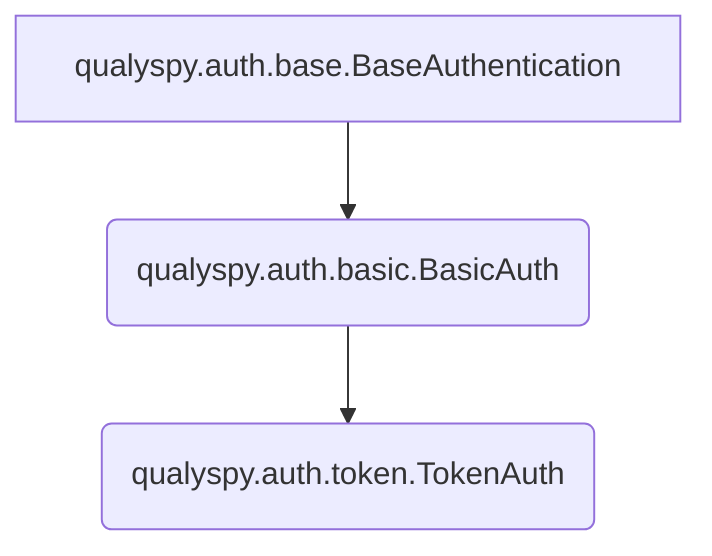

# Auth Classes

```qualyspy``` supports both HTTP Basic Authentication (used mainly for VMDR-based calls) as well as JWT Authentication. 

>**Pro Tip**: Both ```BasicAuth``` and ```TokenAuth``` can be used as **context managers**!

>**Heads Up!**: By default, auth classes assume your Qualys subscription is on the ```qg3``` platform. If this is not the case, simply pass ```platform='qg<n>'``` where \<n> is 1-4 when creating the object.

When calling an API endpoint, just pass your ```TokenAuth``` or ```BasicAuth``` object and the tool will handle the rest (or yell at you if you pass the wrong type, shown below):

```py
#Example of using the wrong auth type
from qualyspy.auth import BasicAuth
from qualyspy.gav import count_assets #GAV expects JWT auth

with BasicAuth(<username>,<password>, platform='qg1') as auth:
    count = count_assets(auth, filter='operatingSystem.category1:`Linux`')
    ...

>>>qualyspy.exceptions.Exceptions.AuthTypeMismatchError: Auth type mismatch. Expected token but got basic.
 ```
 
Both ```BasicAuth``` and ```TokenAuth``` also have ```from_dict``` class methods, which allows for the creation of these objects from dictionaries:

```py
from qualyspy.auth import BasicAuth
auth = BasicAuth.from_dict({'username':<username>, 'password':<password>})
```

You can also create an object using a JSON string using ```from_json_string```:

```py
from qualyspy.auth import BasicAuth
auth = BasicAuth.from_json_string('{"username":<username>, "password":<password>}')
```

You can also export using ```to_json_string```. If ```pretty=True```, the string will be pretty formatted:

```py
from qualyspy.auth import BasicAuth
auth = BasicAuth.from_dict({'username':<username>, 'password':<password>})

#No formatting:
auth.to_json_string()
>>>'{"username": <username>, "password": <password>, "token": null, "auth_type": "basic", "platform": <platform>}'
#With formatting:
auth.to_json_string(pretty=True)
>>>{
    "username": <username>,
    "password": <password>,
    "token": null,
    "auth_type": "basic",
    "platform": <platform>
}
```

## Auth Class Hierarchy

The ```qualyspy.auth``` module has a class hierarchy that looks like this:


